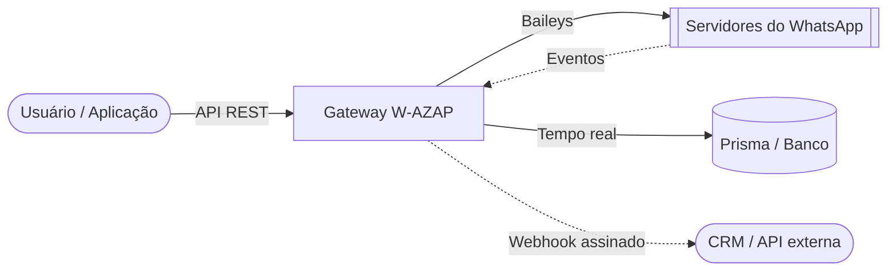

<div align="center">

# 🚀 W-AZAP: Gateway e Painel de WhatsApp

[](https://wa.me/)
[](https://nextjs.org/)
[](https://www.typescriptlang.org/)
[](https://www.prisma.io/)
[](CHANGELOG.md)
[](#-14-idiomas)

[](https://github.com/marloon-dev/w-azap/actions/workflows/ci.yml)
[](https://github.com/marloon-dev/w-azap/actions/workflows/codeql.yml)
[](LICENSE)

**Gateway de WhatsApp profissional com várias sessões, painel administrativo e sistema de automação.**
Construído com **Next.js 16**, **React 19** e **Baileys** para automação de mensagens de alto desempenho e bots de WhatsApp em tempo real.

[Recursos](#-principais-recursos) • [Manual do usuário](docs/USER_GUIDE.md) • [Documentação da API](docs/API_DOCUMENTATION.md) • [Banco de dados](docs/DATABASE_SETUP.md) • [Instalação](#-instalação-rápida)

</div>

---

## 📖 Documentação

O W-AZAP tem documentação completa para desenvolvedores e usuários, toda em português:

- **[Arquitetura do projeto](docs/PROJECT_DOCUMENTATION.md)**: arquitetura, banco de dados e fluxos de lógica.
- **[Documentação da API](docs/API_DOCUMENTATION.md)**: referência OpenAPI completa de todas as rotas REST.
- **[Referência rápida da API](docs/API-QUICK-REFERENCE.md)**: exemplos prontos em cURL, JavaScript e Python.
- **[Variáveis de ambiente](docs/ENVIRONMENT_VARIABLES.md)**: guia de configuração e segurança.
- **[Guia de atualização](docs/UPDATE_GUIDE.md)**: como atualizar e o que muda em cada versão.
- **[Índice completo](docs/README.md)**: todos os documentos.

---

## 🌟 Por que o W-AZAP?

O W-AZAP transforma o seu WhatsApp em uma API REST totalmente programável. Ele foi feito para escalar, ser confiável e fácil de usar, servindo de ponte entre a lógica do seu negócio e o alcance do WhatsApp. Serve bem para criar **bots de WhatsApp**, automações e centrais de atendimento.

### 🏗️ Como funciona



### 🔥 Principais recursos

- **📱 Várias sessões**: conecte e gerencie quantas contas de WhatsApp quiser ao mesmo tempo, por QR code ou código de pareamento.
- **⚡ Motor de WhatsApp robusto**: baseado no `@whiskeysockets/baileys`, com conexões WebSocket rápidas e estáveis.
- **📅 Agendador avançado**: agendamento preciso, mensagens recorrentes (cron) e **suporte a mídia** (imagens, vídeos, documentos).
- **📢 Transmissão segura**: mecanismos contra banimento com atrasos aleatórios, envio em lotes e histórico por destinatário.
- **🤖 Resposta automática inteligente**: correspondência por palavra-chave ou expressão regular, com **contexto** (grupo/privado/todos) e **anexos de mídia**.
- **🛡️ Controle de acesso granular**: **whitelist** e **blacklist** para comandos do bot e respostas automáticas.
- **🔗 Webhooks**: eventos em tempo real (mensagens, conexão, status, grupos) assinados com HMAC-SHA256.
- **📇 Contatos completos**: LID, nomes verificados, fotos de perfil, bloqueio e etiquetas.
- **🎨 Ferramentas criativas**: criador de figurinhas com remoção de fundo (integração com `remove.bg`).
- **👥 Multiusuário**: papéis `SUPERADMIN`, `OWNER` e `STAFF`, com compartilhamento de sessões.
- **🌐 14 idiomas**: seletor de idioma no canto superior direito de todas as telas.
- **📘 Especificação OpenAPI**: Swagger UI interativo em `/swagger` e documentação em texto em `/docs`.

<details>
<summary>📂 <b>Ver exemplo de payload de webhook</b></summary>

```json
{
  "event": "message.received",
  "sessionId": "vendas-01",
  "timestamp": "2026-01-17T05:33:08.545Z",
  "data": {
    "key": { "remoteJid": "5511987654321@s.whatsapp.net", "fromMe": false, "id": "3EB0B78..." },
    "from": "5511987654321@s.whatsapp.net",
    "sender": "100429287395370@lid",
    "remoteJidAlt": "100429287395370@lid",
    "type": "TEXT",
    "content": "Estou respondendo",
    "isGroup": false,
    "quoted": {
      "type": "IMAGE",
      "caption": "Legenda da mensagem respondida",
      "fileUrl": "/media/vendas-01-A54FD0B6F..."
    }
  }
}
```

Cada requisição chega com o cabeçalho `X-Webhook-Signature: sha256=<hmac>`, calculado com o segredo do webhook. Valide a assinatura antes de confiar no conteúdo.
</details>

### 🌐 14 idiomas

Toda a interface (login, painel e páginas internas) está traduzida para:

🇺🇸 English · 🇧🇷 Português (Brasil) · 🇪🇸 Español · 🇫🇷 Français · 🇩🇪 Deutsch · 🇮🇹 Italiano · 🇷🇺 Русский · 🇨🇳 简体中文 · 🇯🇵 日本語 · 🇰🇷 한국어 · 🇸🇦 العربية · 🇮🇳 हिन्दी · 🇮🇩 Bahasa Indonesia · 🇹🇷 Türkçe

O idioma é detectado pelo navegador e pode ser trocado no seletor do canto superior direito. A escolha fica salva no cookie `NEXT_LOCALE`.

---

## 🧩 Integrações: suporte nativo ao n8n

O W-AZAP funciona com o **n8n**: dá para montar fluxos complexos de automação de WhatsApp, sem código ou com pouco código, usando os nós da comunidade.

[](https://www.npmjs.com/package/n8n-nodes-wa-akg)

- **Nó de ação**: controle total de mensagens, grupos, sessões, contatos e etiquetas direto nos seus fluxos.
- **Nó de gatilho**: recebe webhooks em tempo real (mensagem recebida, entrada em grupo etc.) e dispara seus fluxos automaticamente.

👉 **[Ver no npm (n8n-nodes-wa-akg)](https://www.npmjs.com/package/n8n-nodes-wa-akg)**

> [!NOTE]
> Se o n8n roda na mesma máquina ou na rede local, defina `ALLOW_PRIVATE_WEBHOOK_URLS="true"`. Por segurança, webhooks para endereços internos ficam bloqueados por padrão.

---

## 🍎 Instalador para macOS

O jeito mais simples de rodar o W-AZAP num Mac (macOS 15 Sequoia ou mais novo, Apple Silicon ou Intel). Você não precisa de Homebrew, Docker nem senha de administrador. O instalador baixa o Node.js e o MySQL portáteis e confere o SHA-256 deles. Depois gera o `.env` com chaves aleatórias, faz o build e deixa o W-AZAP iniciando sozinho no login.

Abra o **Terminal** e cole:

```bash
curl -fsSL https://github.com/marloon-dev/w-azap/releases/latest/download/instalar-macos.sh | bash
```

Se preferir dois cliques, baixe o `W-AZAP-instalador-macos.zip` da [última release](https://github.com/marloon-dev/w-azap/releases/latest) e abra `Instalar W-AZAP.command`. O arquivo não é assinado pela Apple. Na primeira vez, vá em **Ajustes do Sistema → Privacidade e Segurança → Abrir Mesmo Assim**.

Quando terminar, o painel abre em `http://localhost:3000` (ou na próxima porta livre), e a primeira conta cadastrada vira administrador. Para o dia a dia, use o comando `w-azap` ou o app **W-AZAP** em `~/Applications`:

| Comando | O que faz |
| --- | --- |
| `w-azap status` | Mostra se o MySQL e o servidor estão no ar |
| `w-azap abrir` | Inicia (se preciso) e abre o painel no navegador |
| `w-azap parar` / `w-azap iniciar` | Para ou inicia os serviços |
| `w-azap log` | Acompanha o log do servidor |
| `w-azap atualizar` | Instala a release mais recente e mantém dados e configuração |
| `w-azap desinstalar` | Remove o W-AZAP (pergunta se apaga também os dados) |

Tudo fica em `~/.w-azap`: o código e o `.env` em `app/`, o banco em `mysql/data/` e os logs em `logs/`. O MySQL do instalador usa a porta `3307` e escuta só em `127.0.0.1`. Faça backup do `.env`, porque a `DATA_ENCRYPTION_KEY` protege as sessões do WhatsApp.

---

## 🚀 Instalação rápida

### 1. Pré-requisitos
- Node.js 20.9+ (22 recomendado)
- MySQL 8 ou PostgreSQL
- Git
- PM2 (instalado globalmente: `npm install -g pm2`), para produção

### 2. Configuração
```bash
# Clonar e instalar
git clone https://github.com/marloon-dev/w-azap.git
cd w-azap
npm install
npx patch-package          # aplica o patch do Baileys (o npm 11+ pode bloquear o postinstall)

# Configurar o ambiente
cp .env.example .env
# Edite o .env: DATABASE_URL, AUTH_SECRET, DATA_ENCRYPTION_KEY, PORT, BASE_URL...
# Gere os segredos com: openssl rand -base64 32

# Criar as tabelas e gerar o Prisma Client
npm run db:push

# Criar a conta Super Admin (ou cadastre a primeira conta pelo navegador)
npm run make-admin admin@exemplo.com 'Uma-Senha-Forte-123'
```

### 3. Executar (desenvolvimento)
```bash
npm run dev
```
Acesse `http://localhost:3000` (ou a porta definida em `PORT`).

### 4. Executar (produção com PM2, recomendado)
Recomendamos o **PM2** para manter a aplicação em segundo plano e reiniciá-la automaticamente se o servidor reiniciar ou o processo cair.

#### Opção A: script automático (mais fácil)
O script [`start.sh`](start.sh) faz tudo: confere a configuração, instala as dependências, sincroniza o banco, compila os arquivos de produção e inicia (ou recarrega) o PM2.
```bash
./start.sh
```

#### Opção B: manual
1. **Compilar a aplicação**:
   ```bash
   npm run build
   ```

2. **Iniciar com o PM2**, usando o arquivo [`ecosystem.config.js`](ecosystem.config.js):
   ```bash
   pm2 start ecosystem.config.js
   ```

3. **Gerenciar o processo**:
   - Status: `pm2 status`
   - Logs: `pm2 logs w-azap`
   - Parar: `pm2 stop w-azap`
   - Reiniciar: `pm2 restart w-azap`

4. **Iniciar junto com o servidor**:
   ```bash
   pm2 startup
   # Copie e execute o comando que aparecer
   pm2 save
   ```

> [!IMPORTANT]
> Por segurança, o servidor escuta apenas em `127.0.0.1`. Para acessar pela internet, coloque um proxy reverso com HTTPS (Nginx, Caddy, Cloudflare Tunnel) na frente. Se precisar expor direto na rede, defina `BIND_HOST="0.0.0.0"`.

---

### 🐋 Alternativa: Docker

Embora o **PM2 seja o recomendado**, também é possível usar o Docker Compose:

1. **Preparar o ambiente**:
   ```bash
   cp .env.example .env
   ```
   Edite o `.env` e defina `AUTH_SECRET`, `DATA_ENCRYPTION_KEY`, `MYSQL_ROOT_PASSWORD`, `ADMIN_EMAIL`, `ADMIN_PASSWORD` e `BASE_URL`. A `DATABASE_URL` é montada automaticamente para o container do MySQL.

2. **Subir os serviços**:
   ```bash
   docker compose up -d
   ```
   Isso sobe o MySQL junto com a aplicação, cria as tabelas e a conta Super Admin.

---

## 📚 Visão geral da API

O W-AZAP oferece uma API REST completa para integrar o WhatsApp às suas aplicações. Detalhes em [API_DOCUMENTATION.md](docs/API_DOCUMENTATION.md).

> [!TIP]
> Use o **Swagger UI** em `/swagger` para explorar a API de forma interativa (exige login no painel).

| Método | Endpoint | Descrição |
| :--- | :--- | :--- |
| `POST` | `/api/sessions` | Criar uma sessão do WhatsApp |
| `POST` | `/api/messages/{sessionId}/{jid}/send` | Enviar texto, mídia ou figurinha |
| `POST` | `/api/messages/{sessionId}/broadcast` | Envio em massa |
| `PATCH` | `/api/sessions/{id}/settings` | Atualizar as configurações da sessão |
| `GET` | `/api/groups/{sessionId}` | Listar os grupos |
| `POST` | `/api/webhooks/{sessionId}` | Registrar um webhook de eventos |
| `POST` | `/api/autoreplies/{sessionId}` | Criar uma resposta automática |

### Autenticação

Gere sua chave em **Painel › Webhooks e API**. Ela aparece **uma única vez**: copie e guarde em local seguro. Envie-a no cabeçalho `X-API-Key`.

### Exemplo: enviar uma mensagem de texto
```bash
curl -X POST "http://localhost:3000/api/messages/vendas-01/5511987654321%40s.whatsapp.net/send" \
  -H "X-API-Key: sua_chave_de_api" \
  -H "Content-Type: application/json" \
  -d '{
    "message": { "text": "Olá do W-AZAP!" }
  }'
```

---

## ⚠️ Problemas conhecidos

> [!WARNING]
> - **Status do WhatsApp (stories)**: a publicação de status pela API **não está disponível** nesta versão. Os endpoints `/api/status/...` citados em versões antigas da documentação não existem.
> - **Resposta automática "Começa com"**: a opção `STARTS_WITH` aparece no painel, mas o motor ainda não a aplica. Use `REGEX` com `^palavra`.
> - **Baileys 7.0.0-rc.9**: a biblioteca é uma versão candidata com patch próprio (`patches/`) e tem um aviso de segurança em aberto. A atualização exige recriar o patch.

---

## 🛡️ Segurança

- **Chave de API**: autenticação pelo cabeçalho `X-API-Key`. A chave é guardada só como hash e exibida uma única vez.
- **RBAC**: papéis `SUPERADMIN`, `OWNER` e `STAFF`; cada usuário só acessa as próprias sessões ou as compartilhadas com ele.
- **Senhas**: hash bcrypt, mínimo de 8 caracteres, bloqueio após tentativas repetidas.
- **Login (JWT)**: assinado com `AUTH_SECRET` (obrigatório, sem valor padrão), com expiração configurável e revogação ao trocar a senha ou o papel.
- **Cadastro fechado**: só a primeira conta se cadastra sozinha (e vira Super Admin); as demais são criadas pelo administrador.
- **Criptografia em repouso**: chaves de sessão do WhatsApp protegidas com AES-256-GCM (`DATA_ENCRYPTION_KEY`).
- **Anti-SSRF**: webhooks e URLs de mídia não podem apontar para a rede interna.
- **Rate limiting**: limites por minuto na API, no login e no cadastro.
- **Tempo real protegido**: o Socket.IO exige autenticação e valida a origem e o acesso a cada sessão.
- **Cabeçalhos HTTP**: CSP, `X-Frame-Options`, HSTS e outros.
- **Validação de entrada**: schemas Zod nos endpoints críticos.
- **Proteção da mídia**: bloqueio de path traversal e acesso à mídia restrito à sessão.
- **Sem telemetria**: nenhum dado é enviado a servidores de terceiros.

Encontrou uma vulnerabilidade? Veja a [política de segurança](.github/SECURITY.md) e relate em privado pelo [GitHub Security Advisories](https://github.com/marloon-dev/w-azap/security/advisories/new).

---

## 🤝 Contribuindo

Contribuições são bem-vindas! Leia o [guia de contribuição](.github/CONTRIBUTING.md) e o [código de conduta](.github/CODE_OF_CONDUCT.md) antes de abrir um PR. Dúvidas de uso vão em [Discussions](https://github.com/marloon-dev/w-azap/discussions); bugs e sugestões, em [Issues](https://github.com/marloon-dev/w-azap/issues).

## ⚖️ Aviso

O W-AZAP não é afiliado, associado nem endossado pelo WhatsApp ou pela Meta. Ele usa a biblioteca não oficial [Baileys](https://github.com/WhiskeySockets/Baileys), e o uso de clientes não oficiais pode levar ao bloqueio da conta. Use com responsabilidade, sem spam, e respeite os [Termos de Serviço do WhatsApp](https://www.whatsapp.com/legal/terms-of-service).

---

<div align="center">

Mantido por <a href="https://github.com/marloon-dev">marloon-dev</a>.<br/>
Baseado no projeto <a href="https://github.com/mrifqidaffaaditya/WA-AKG">WA-AKG</a>, criado por <a href="https://github.com/mrifqidaffaaditya">Aditya</a>.<br/>
Licenciado sob a <a href="LICENSE">MIT</a>.

</div>
