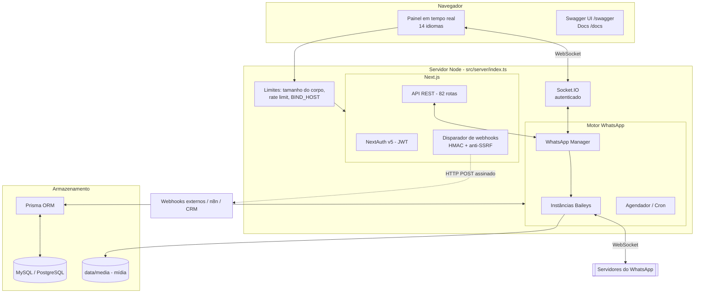

# 🏗️ Arquitetura e Lógica do W-AZAP

> **Versão**: 1.6.4
> **Atualizado em**: outubro de 2026
> **Stack**: Next.js 16 (App Router + Turbopack), React 19, TypeScript, Prisma 5, MySQL/PostgreSQL, Baileys 7, Socket.IO 4, NextAuth v5, Tailwind CSS.

---

## 🏗️ Arquitetura do sistema

O W-AZAP roda como **um único processo Node.js**. Um servidor HTTP próprio (`src/server/index.ts`) hospeda ao mesmo tempo:
- o Next.js (painel e API REST);
- o Socket.IO (eventos em tempo real);
- o motor do WhatsApp (Baileys).



---

## 📂 Estrutura de diretórios

```text
src/
├── server/
│   ├── index.ts           # Servidor HTTP: Next + Socket.IO + limites + início do Baileys
│   └── socket.ts          # Autenticação do Socket.IO e controle de acesso às salas
├── app/                   # Páginas e rotas de API (App Router)
│   ├── api/               # 82 rotas REST
│   ├── dashboard/         # Painel administrativo protegido
│   ├── auth/              # Login, cadastro e sessão expirada
│   ├── docs/              # Documentação da API em texto (lê docs/API_DOCUMENTATION.md)
│   └── swagger/           # Swagger UI interativo
├── components/            # Componentes de interface (shadcn/ui)
│   ├── i18n-provider.tsx  # Contexto de idioma (useTranslation)
│   └── language-switcher.tsx
├── lib/
│   ├── i18n/              # 14 idiomas: dicionários, tradutor, locales do date-fns
│   ├── api-auth.ts        # getAuthenticatedUser (cookie ou X-API-Key)
│   ├── session-access.ts  # canAccessSession, hashApiKey, isAdmin
│   ├── safe-fetch.ts      # Requisições externas com bloqueio de SSRF e limite de tamanho
│   ├── media-payload.ts   # Converte URLs de mídia em buffers (impede leitura de arquivos locais)
│   ├── data-encryption.ts # AES-256-GCM para segredos em repouso
│   ├── rate-limit.ts      # Limitador em memória (API, login, cadastro)
│   ├── webhook.ts         # Disparo de webhooks com assinatura HMAC e logs
│   └── swagger.ts         # Especificação OpenAPI (fonte da documentação)
├── modules/whatsapp/
│   ├── manager.ts         # Ciclo de vida das sessões
│   ├── instance.ts        # Uma conexão Baileys
│   ├── auth/              # AuthState no Prisma (criptografado)
│   ├── bot/               # Comandos do bot (#ping, #sticker…)
│   ├── store/             # Contatos, grupos, respostas automáticas
│   └── scheduler.ts       # Mensagens agendadas e recorrentes
└── types/                 # Tipos globais do TypeScript
```

---

## 🗄️ Modelos do banco de dados (Prisma)

O schema relacional é pensado para mensagens com várias sessões.

| Categoria | Modelos | Descrição |
| :--- | :--- | :--- |
| **Núcleo** | `User`, `Session`, `AuthState`, `SessionAccess` | Usuários (com hash da chave de API e `sessionVersion` para revogação), sessões do WhatsApp, chaves criptografadas e compartilhamento entre usuários. |
| **Mensagens** | `Message`, `Contact`, `Group`, `Story` | Histórico de conversas e metadados sincronizados. |
| **Automação** | `AutoReply`, `ScheduledMessage`, `BroadcastLog`, `BroadcastRecipient` | Respostas automáticas (com **controle de acesso** e **contexto**), agendamentos e histórico de transmissões. |
| **Configuração** | `BotConfig`, `SystemConfig` | Configurações do bot por sessão (whitelist/blacklist) e configurações globais (marca, fuso horário, cadastro). |
| **Infraestrutura** | `Webhook`, `WebhookLog`, `Notification`, `Label`, `ChatLabel` | Webhooks e seus logs, notificações e etiquetas. |

---

## ⚡ Fluxos principais

### 1. Ciclo de vida da conexão
Quando o usuário adiciona uma sessão:
1. A API valida o ID (ou gera um aleatório) e cria o registro `Session`.
2. O `WhatsAppManager` inicia uma nova instância do Baileys.
3. O QR code (ou código de pareamento) é enviado em tempo real pelo Socket.IO, apenas para a sala daquela sessão, que só quem tem acesso pode acessar.
4. Após o escaneamento, as credenciais são **criptografadas com AES-256-GCM** e salvas em `AuthState`. O ID da sessão e a chave entram como dado autenticado (AAD), o que impede copiar uma linha para outra sessão.
5. Ao reiniciar o servidor, o manager reconecta todas as sessões e criptografa qualquer linha antiga em texto puro.

### 2. Mensagens e webhooks
Toda mensagem recebida segue este caminho:
1. O evento `messages.upsert` do Baileys dispara.
2. Os dados são enriquecidos: informações do participante e download da mídia.
3. O registro é salvo na tabela `Message`.
4. O disparador identifica os webhooks ativos daquela sessão para o tipo de evento.
5. O payload é assinado (`X-Webhook-Signature: sha256=...`) e enviado de forma assíncrona via `safeFetch`. Cada entrega fica registrada em `WebhookLog`; não há nova tentativa automática em caso de falha.

### 3. Autenticação e autorização
1. **Navegador**: login com e-mail e senha (bcrypt). O NextAuth emite um JWT no cookie `authjs.session-token`.
2. **Integrações**: cabeçalho `X-API-Key`. A chave é comparada pelo hash SHA-256.
3. A cada requisição, o JWT é revalidado no banco (papel e `sessionVersion`). Trocar a senha, o e-mail ou o papel invalida os logins antigos.
4. Toda rota com `sessionId` chama `canAccessSession`: o dono, quem recebeu compartilhamento ou o `SUPERADMIN`.

### 4. Controle de acesso e automação
- **Acesso granular**:
  - o `BotConfig` define quem usa os comandos do bot (`#ping` etc.) nos modos `OWNER`, `ALL`, `SPECIFIC` (whitelist) ou `BLACKLIST`;
  - as respostas automáticas têm o mesmo controle, configurado de forma independente.
- **Contexto**: respostas automáticas podem valer para `ALL`, `GROUP` ou `PRIVATE`.
- **Mídia**: agendador e respostas automáticas enviam imagens, vídeos e documentos por URL pública.

### 5. Internacionalização
- 14 idiomas: `en`, `pt-BR`, `es`, `fr`, `de`, `it`, `ru`, `zh-CN`, `ja`, `ko`, `ar`, `hi`, `id`, `tr`.
- O idioma vem do cookie `NEXT_LOCALE` (definido pelo seletor no canto superior direito) ou do cabeçalho `Accept-Language`.
- Dicionários tipados em `src/lib/i18n/dictionaries/`: o TypeScript acusa chaves faltando.

---

## 🛡️ Camadas de segurança

| Camada | Onde | O que faz |
| :--- | :--- | :--- |
| Rede | `src/server/index.ts` | Escuta em `BIND_HOST` (padrão `127.0.0.1`), recusa corpos acima de `MAX_UPLOAD_SIZE_MB` e aplica o rate limit da API. |
| HTTP | `next.config.ts` | CSP, `X-Frame-Options`, `nosniff`, `Referrer-Policy`, `Permissions-Policy`, HSTS. |
| Sessão | `src/lib/auth.ts`, `src/auth.config.ts` | JWT com expiração (`SESSION_TIMEOUT_HOURS`), revogação por `sessionVersion`, limite de tentativas de login. |
| Tempo real | `src/server/socket.ts` | Socket.IO exige login ou chave de API, valida a origem e a permissão por sala. |
| Saída | `src/lib/safe-fetch.ts` | Bloqueia SSRF (IPs privados, loopback, link-local, metadados de nuvem) e limita tamanho e tempo dos downloads. |
| Dados | `src/lib/data-encryption.ts` | AES-256-GCM nas chaves do WhatsApp; chaves de API apenas em hash. |
| Processos | `src/modules/whatsapp/bot/command-handler.ts` | O ffmpeg roda via `execFile` com tempo limite e tamanho máximo (sem shell). |

---

## 🚀 Ambiente e deploy

A configuração fica centralizada no `.env` (veja [ENVIRONMENT_VARIABLES.md](./ENVIRONMENT_VARIABLES.md)). O projeto suporta:
1. **Bare-metal com PM2** (`./start.sh` ou `npm run build` + `pm2 start ecosystem.config.js`).
2. **Docker Compose** (`docker-compose.yml`), que coordena:
   - um MySQL 8.0 com volume persistente, acessível só em `127.0.0.1`;
   - o container da aplicação, que roda o servidor `tsx`, sincroniza o banco na inicialização (`npx prisma db push`) e escuta em `0.0.0.0` dentro do container.

> [!CAUTION]
> O Docker Compose lê as credenciais do arquivo `.env`. Nunca use os valores de exemplo de `AUTH_SECRET`, `DATA_ENCRYPTION_KEY`, `MYSQL_ROOT_PASSWORD` ou `ADMIN_PASSWORD` em produção. Rode `cp .env.example .env` e edite antes do `docker compose up`.

> [!IMPORTANT]
> Depois de atualizar em bare-metal, sempre rode `npm run db:push` e reinicie o processo. No Docker, esse passo é automático na inicialização do container.

> [!NOTE]
> **Baileys com patch**: o projeto usa `@whiskeysockets/baileys@7.0.0-rc.9` com um patch de 367 arquivos em `patches/`, aplicado pelo `patch-package`. Atualizar o Baileys exige recriar esse patch.

---
<div align="center">
  <small>Referência técnica para a equipe de desenvolvimento do W-AZAP.</small>
</div>
